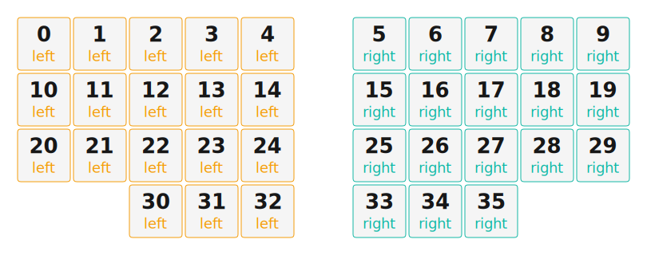

# ZMK Configuration for relic

*Generated by Shield Wizard for ZMK*



Download compiled firmware from the Actions tab. <https://zmk.dev/docs/user-setup#installing-the-firmware>

Edit your keymap <https://zmk.dev/docs/keymaps>.
User keymap is located at [`config/relic.keymap`](config/relic.keymap).

-----

<details>
<summary>
Shield Wizard Debug Information
</summary>

In case of broken configuration, here is the Shield Wizard internal data used to generate this configuration:

Commit: 5840d41ac0915092c8fe45da617ffb4bb91e1b97

```json
{"name":"relic","shield":"relic","dongle":false,"modules":[],"layout":[{"id":"01KQAKN9AM62NKBTBVKACAW7H8","part":0,"row":0,"col":0,"w":1,"h":1,"x":0,"y":0,"r":0,"rx":0,"ry":0},{"id":"01KQAKN9G8MJPYBA6NY4N3HPPR","part":0,"row":0,"col":1,"w":1,"h":1,"x":1,"y":0,"r":0,"rx":0,"ry":0},{"id":"01KQAKN9PGE61D7QG54AZSQM0K","part":0,"row":0,"col":2,"w":1,"h":1,"x":2,"y":0,"r":0,"rx":0,"ry":0},{"id":"01KQAKN9X2AK0ZJZMGWTT664RY","part":0,"row":0,"col":3,"w":1,"h":1,"x":3,"y":0,"r":0,"rx":0,"ry":0},{"id":"01KQAKNA37F6PDNGVD7N20B0ME","part":0,"row":0,"col":4,"w":1,"h":1,"x":4,"y":0,"r":0,"rx":0,"ry":0},{"id":"01KQAKRZ7A736KBNYN72BJN9BK","part":1,"row":0,"col":6,"w":1,"h":1,"x":6,"y":0,"r":0,"rx":0,"ry":0},{"id":"01KQAKRZD4X0664EPB3C1Z8NKT","part":1,"row":0,"col":7,"w":1,"h":1,"x":7,"y":0,"r":0,"rx":0,"ry":0},{"id":"01KQAKRZKNPKEFZXVNGMFFGWTX","part":1,"row":0,"col":8,"w":1,"h":1,"x":8,"y":0,"r":0,"rx":0,"ry":0},{"id":"01KQAKRZT3533W5X6YZ3STV2QV","part":1,"row":0,"col":9,"w":1,"h":1,"x":9,"y":0,"r":0,"rx":0,"ry":0},{"id":"01KQAKS00JEHWVP579H6SE6DB2","part":1,"row":0,"col":10,"w":1,"h":1,"x":10,"y":0,"r":0,"rx":0,"ry":0},{"id":"01KQAKS9SXRH2QMJS9ED4GXSWB","part":0,"row":1,"col":0,"w":1,"h":1,"x":0,"y":1,"r":0,"rx":0,"ry":0},{"id":"01KQAKSA0CBF9XFKE6BNH5DHKH","part":0,"row":1,"col":1,"w":1,"h":1,"x":1,"y":1,"r":0,"rx":0,"ry":0},{"id":"01KQAKSA71BVSAXWR2K4XH2A8W","part":0,"row":1,"col":2,"w":1,"h":1,"x":2,"y":1,"r":0,"rx":0,"ry":0},{"id":"01KQAKSAJP3AS7823H6CG3FQS6","part":0,"row":1,"col":3,"w":1,"h":1,"x":3,"y":1,"r":0,"rx":0,"ry":0},{"id":"01KQAKSNH68NJBYZ5YKBT0K5CE","part":0,"row":1,"col":4,"w":1,"h":1,"x":4,"y":1,"r":0,"rx":0,"ry":0},{"id":"01KQAKSNR3AD2ZXC55VF3MQ8ZA","part":1,"row":1,"col":6,"w":1,"h":1,"x":6,"y":1,"r":0,"rx":0,"ry":0},{"id":"01KQAKSNZ3W8XK1X8R7QWD96DE","part":1,"row":1,"col":7,"w":1,"h":1,"x":7,"y":1,"r":0,"rx":0,"ry":0},{"id":"01KQAKSP5H0AR8R6VK8ZGPADPR","part":1,"row":1,"col":8,"w":1,"h":1,"x":8,"y":1,"r":0,"rx":0,"ry":0},{"id":"01KQAKSPBGATA69MS30A6Q1YRX","part":1,"row":1,"col":9,"w":1,"h":1,"x":9,"y":1,"r":0,"rx":0,"ry":0},{"id":"01KQAKT0CWSGPSQ9Y9VBGF6SK5","part":1,"row":1,"col":10,"w":1,"h":1,"x":10,"y":1,"r":0,"rx":0,"ry":0},{"id":"01KQAKPMJX5W4JS847XPPGJ2MF","part":0,"row":2,"col":0,"w":1,"h":1,"x":0,"y":2,"r":0,"rx":0,"ry":0},{"id":"01KQAKPMRYZF6SV2KFHTVA0F8Y","part":0,"row":2,"col":1,"w":1,"h":1,"x":1,"y":2,"r":0,"rx":0,"ry":0},{"id":"01KQAKPNFGCVBQY8TYJ40GPX3E","part":0,"row":2,"col":2,"w":1,"h":1,"x":2,"y":2,"r":0,"rx":0,"ry":0},{"id":"01KQAKNC13MXP1GPYJMD26JBVW","part":0,"row":2,"col":3,"w":1,"h":1,"x":3,"y":2,"r":0,"rx":0,"ry":0},{"id":"01KQAKNC8N0ZKDWKS8KR9X8G3S","part":0,"row":2,"col":4,"w":1,"h":1,"x":4,"y":2,"r":0,"rx":0,"ry":0},{"id":"01KQAKNAA87PBBCRD64Z8KVQ8X","part":1,"row":2,"col":6,"w":1,"h":1,"x":6,"y":2,"r":0,"rx":0,"ry":0},{"id":"01KQAKNB69NWM1BV6GFN7DD92K","part":1,"row":2,"col":7,"w":1,"h":1,"x":7,"y":2,"r":0,"rx":0,"ry":0},{"id":"01KQAKNBC7DC9X700JQAG0730Q","part":1,"row":2,"col":8,"w":1,"h":1,"x":8,"y":2,"r":0,"rx":0,"ry":0},{"id":"01KQAKNBK0Y40GRAH1TXRG2W29","part":1,"row":2,"col":9,"w":1,"h":1,"x":9,"y":2,"r":0,"rx":0,"ry":0},{"id":"01KQAKNBSPS21V548CHGTETD8T","part":1,"row":2,"col":10,"w":1,"h":1,"x":10,"y":2,"r":0,"rx":0,"ry":0},{"id":"01KQAKP7RN8VJRXXFQSS3JNAK2","part":0,"row":3,"col":2,"w":1,"h":1,"x":2,"y":3,"r":0,"rx":0,"ry":0},{"id":"01KQAKP8AXVZRE7EVYQFKJ5YJR","part":0,"row":3,"col":3,"w":1,"h":1,"x":3,"y":3,"r":0,"rx":0,"ry":0},{"id":"01KQAKP96VE1QDQ26N31MPWCDH","part":0,"row":3,"col":4,"w":1,"h":1,"x":4,"y":3,"r":0,"rx":0,"ry":0},{"id":"01KQAKS9M2DBY2HBEA6QS3EZZV","part":1,"row":3,"col":6,"w":1,"h":1,"x":6,"y":3,"r":0,"rx":0,"ry":0},{"id":"01KQAKT0JEGEM2PN0NASKNCA15","part":1,"row":3,"col":7,"w":1,"h":1,"x":7,"y":3,"r":0,"rx":0,"ry":0},{"id":"01KQAKT0VY5SFWMTHR6ZAQNRHP","part":1,"row":3,"col":8,"w":1,"h":1,"x":8,"y":3,"r":0,"rx":0,"ry":0}],"parts":[{"name":"left","controller":"xiao_ble","wiring":"matrix_diode","keys":{"01KQAKN9AM62NKBTBVKACAW7H8":{"output":"d0","input":"d10"},"01KQAKS9SXRH2QMJS9ED4GXSWB":{"output":"d0","input":"d9"},"01KQAKPMJX5W4JS847XPPGJ2MF":{"output":"d0","input":"d8"},"01KQAKN9G8MJPYBA6NY4N3HPPR":{"output":"d1","input":"d10"},"01KQAKSA0CBF9XFKE6BNH5DHKH":{"output":"d1","input":"d9"},"01KQAKPMRYZF6SV2KFHTVA0F8Y":{"output":"d1","input":"d8"},"01KQAKN9PGE61D7QG54AZSQM0K":{"output":"d2","input":"d10"},"01KQAKSA71BVSAXWR2K4XH2A8W":{"output":"d2","input":"d9"},"01KQAKPNFGCVBQY8TYJ40GPX3E":{"output":"d2","input":"d8"},"01KQAKP7RN8VJRXXFQSS3JNAK2":{"output":"d2","input":"d7"},"01KQAKN9X2AK0ZJZMGWTT664RY":{"output":"d3","input":"d10"},"01KQAKSAJP3AS7823H6CG3FQS6":{"output":"d3","input":"d9"},"01KQAKNC13MXP1GPYJMD26JBVW":{"output":"d3","input":"d8"},"01KQAKP8AXVZRE7EVYQFKJ5YJR":{"output":"d3","input":"d7"},"01KQAKNA37F6PDNGVD7N20B0ME":{"output":"d4","input":"d10"},"01KQAKSNH68NJBYZ5YKBT0K5CE":{"output":"d4","input":"d9"},"01KQAKNC8N0ZKDWKS8KR9X8G3S":{"output":"d4","input":"d8"},"01KQAKP96VE1QDQ26N31MPWCDH":{"output":"d4","input":"d7"}},"encoders":[],"pins":{"d0":"output","d1":"output","d2":"output","d3":"output","d4":"output","d10":"input","d9":"input","d8":"input","d7":"input"},"buses":[{"type":"spi","name":"spi0","devices":[]},{"type":"spi","name":"spi1","devices":[]},{"type":"spi","name":"spi2","devices":[]},{"type":"spi","name":"spi3","devices":[]},{"type":"i2c","name":"i2c0","devices":[]},{"type":"i2c","name":"i2c1","devices":[]}]},{"name":"right","controller":"xiao_ble","wiring":"matrix_diode","keys":{"01KQAKS9M2DBY2HBEA6QS3EZZV":{"input":"d7","output":"d0"},"01KQAKT0JEGEM2PN0NASKNCA15":{"input":"d7","output":"d1"},"01KQAKT0VY5SFWMTHR6ZAQNRHP":{"input":"d7","output":"d2"},"01KQAKNAA87PBBCRD64Z8KVQ8X":{"input":"d8","output":"d0"},"01KQAKNB69NWM1BV6GFN7DD92K":{"input":"d8","output":"d1"},"01KQAKNBC7DC9X700JQAG0730Q":{"input":"d8","output":"d2"},"01KQAKNBK0Y40GRAH1TXRG2W29":{"input":"d8","output":"d3"},"01KQAKNBSPS21V548CHGTETD8T":{"input":"d8","output":"d4"},"01KQAKSNR3AD2ZXC55VF3MQ8ZA":{"input":"d9","output":"d0"},"01KQAKSNZ3W8XK1X8R7QWD96DE":{"input":"d9","output":"d1"},"01KQAKSP5H0AR8R6VK8ZGPADPR":{"input":"d9","output":"d2"},"01KQAKSPBGATA69MS30A6Q1YRX":{"input":"d9","output":"d3"},"01KQAKT0CWSGPSQ9Y9VBGF6SK5":{"input":"d9","output":"d4"},"01KQAKRZ7A736KBNYN72BJN9BK":{"input":"d10","output":"d0"},"01KQAKRZD4X0664EPB3C1Z8NKT":{"input":"d10","output":"d1"},"01KQAKRZKNPKEFZXVNGMFFGWTX":{"input":"d10","output":"d2"},"01KQAKRZT3533W5X6YZ3STV2QV":{"input":"d10","output":"d3"},"01KQAKS00JEHWVP579H6SE6DB2":{"input":"d10","output":"d4"}},"encoders":[],"pins":{"d0":"output","d1":"output","d2":"output","d3":"output","d4":"output","d10":"input","d9":"input","d8":"input","d7":"input"},"buses":[{"type":"spi","name":"spi0","devices":[]},{"type":"spi","name":"spi1","devices":[]},{"type":"spi","name":"spi2","devices":[]},{"type":"spi","name":"spi3","devices":[]},{"type":"i2c","name":"i2c0","devices":[]},{"type":"i2c","name":"i2c1","devices":[]}]}]}
```

</details>
